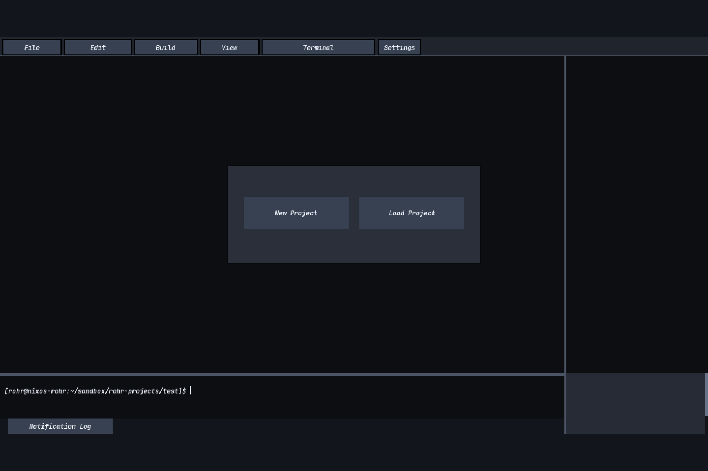
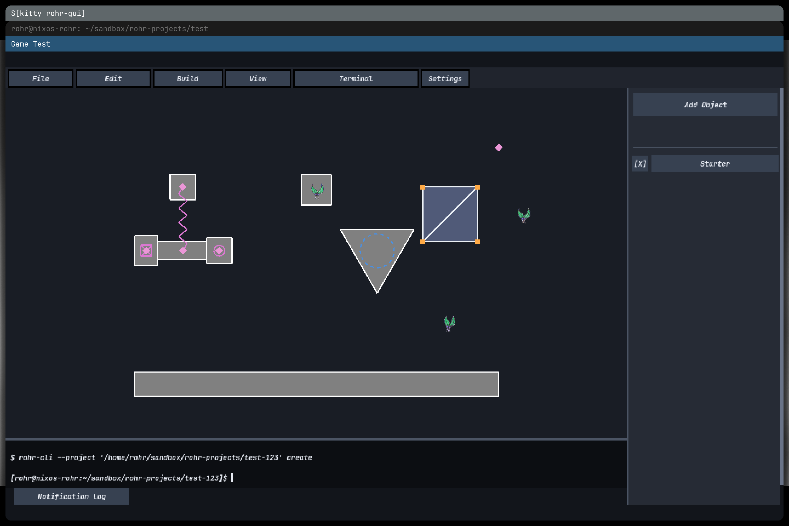
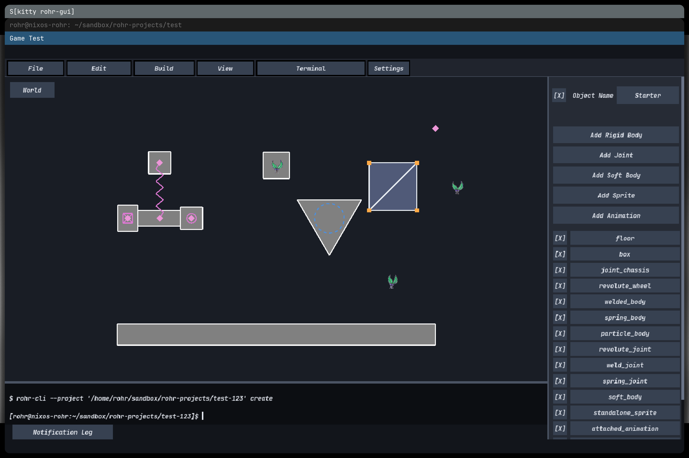
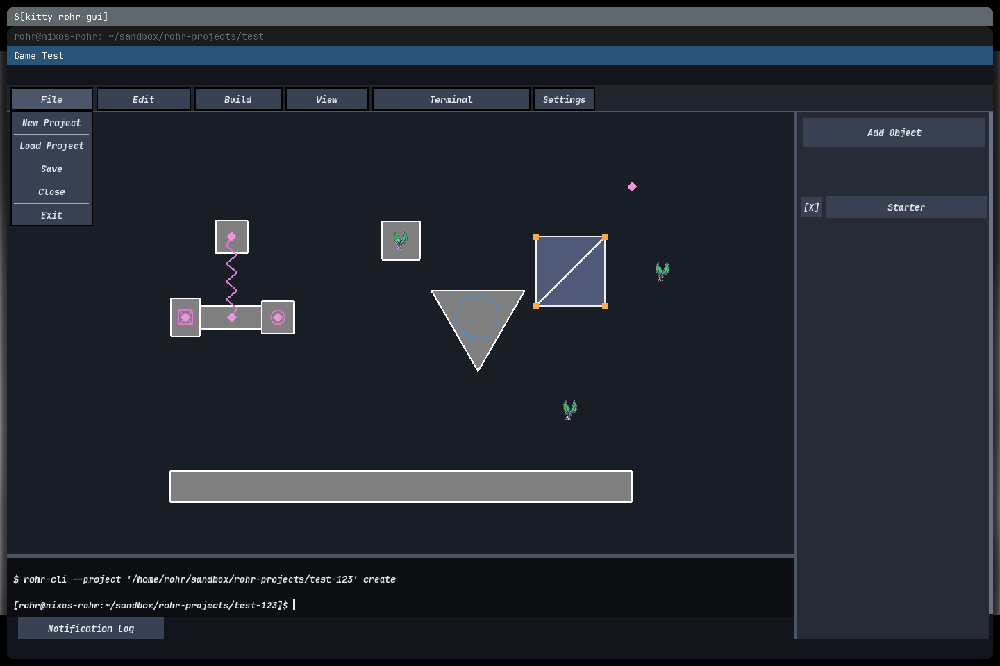
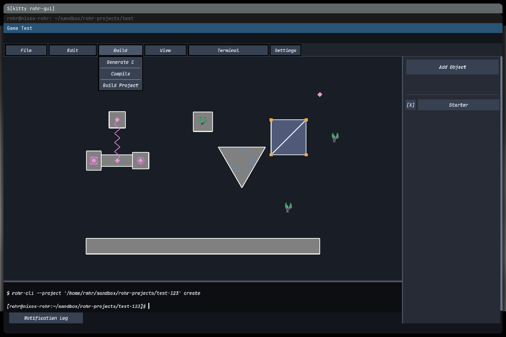

# Your first Rohr project

This guide assumes you have never built a game or used a command line before.
It takes you from building the Rohr SDK to running your first game.

## 1. Open a terminal

A terminal is a window where you type commands. Type one command at a time and
press **Enter** after each line.

Clone Rohr and enter its directory:

```sh
git clone https://github.com/Aaron-Roar/rohr-engine.git
cd rohr-engine
```

`git clone` downloads Rohr. `cd rohr-engine` moves the terminal into the
downloaded directory.

## 2. Build the SDK and open the editor

Choose the section for your computer. You only need one SDK.

### Generic Linux

Docker or Podman must be installed and running.

```sh
./dev.sh sdk-linux
./dist/linux/bin/rohr-gui
```

### Linux with Nix

```sh
./dev.sh sdk-nix
./dist/nix/bin/rohr-gui
```

### Windows

Open a **Visual Studio Developer PowerShell**, then run:

```powershell
dev.bat sdk
dist\windows\bin\rohr-gui.exe
```

The first command builds the SDK. The second command starts the editor binary
from that SDK. Keep the terminal open while the editor is running; build output
and errors may appear there.

## 3. Create a project

The editor starts with **New Project** and **Load Project**.



1. Click **New Project**.
2. Browse to the directory that should contain your game.
3. Enter `my_first_game` as the new directory name.
4. Click **Create Project**.

The editor creates a `my_first_game` directory and fills it with a complete
starter project. Do not create that directory yourself first; select its parent
directory and let Rohr create it.

## 4. Look around the starter project

The starter project demonstrates rigid bodies, joints, a soft body, a particle,
a sprite, and an animation.



The large area is the viewport. It shows the game objects. The right column is
the hierarchy. It lists everything stored in the project.

- Single-click an item to select it.
- Double-click an item to edit it.
- Press **Escape** to return to its parent.
- Drag visible items in the viewport to move them.
- Press **Ctrl+Z** to undo and **Ctrl+Y** to redo.

Double-click the `Starter` object to see the bodies, joints, soft body, sprite,
and animation that belong to it.



You do not have to change anything before running the starter game.

## 5. Save the project

Open **File** and click **Save**.



Saving records the editable project. It does not compile the game. Rohr keeps
the editable scene in JSON so you can reopen it later.

## 6. Generate and compile the game

Open **Build** and click **Build Project**.



**Build Project** performs both required steps:

1. **Generate C** converts the editor objects into C source code.
2. **Compile** turns the C source into a runnable game program.

Watch the editor terminal and notifications. A success notification means the
game executable is ready. A failure notification can be clicked for details.

## 7. Run the game

Open another terminal and enter your project directory. Replace the example
path with the directory you selected when creating the project:

```sh
cd /path/to/my_first_game
```

On Linux or Nix, run:

```sh
./build/MyFirstGame
```

On Windows with Visual Studio, run:

```powershell
.\build\Debug\MyFirstGame.exe
```

Some Windows CMake generators place it directly in `build` instead:

```powershell
.\build\MyFirstGame.exe
```

`MyFirstGame` is the PascalCase form of the project directory name
`my_first_game`. Press **Escape** or close the game window to stop the game.

## 8. Find your files

Your project is laid out like this:

```text
my_first_game/
|-- CMakeLists.txt                 instructions used to compile the game
|-- project.rohr.json             project information
|-- editor.lua                    project build configuration
|-- objects/
|   `-- project.rohr.json         objects edited by rohr-gui
|-- src/
|   |-- main.c                    your hand-written game behavior starts here
|   `-- generated/
|       |-- project_objects.c     generated object implementation
|       `-- project_objects.h     generated object API
`-- build/
    `-- MyFirstGame               Linux/Nix game executable
```

On Windows the executable normally ends in `.exe` and may be inside
`build\Debug\`.

The important distinction is:

- Edit game objects visually in `rohr-gui`.
- Write custom game behavior in `src/main.c`.
- Do not hand-edit `src/generated/`; **Generate C** replaces those files.
- Do not edit files inside `build/`; the compiler creates them.

## 9. Build again later

After changing objects, save and choose **Build > Build Project** again. After
changing only `src/main.c`, **Build > Compile** is enough.

You can also build from a terminal with the SDK CLI:

```sh
/path/to/sdk/bin/rohr-cli --project /path/to/my_first_game build
```

For more detail, see [Building and using Rohr](building.md) and the full
[Editor guide](editor.md).
